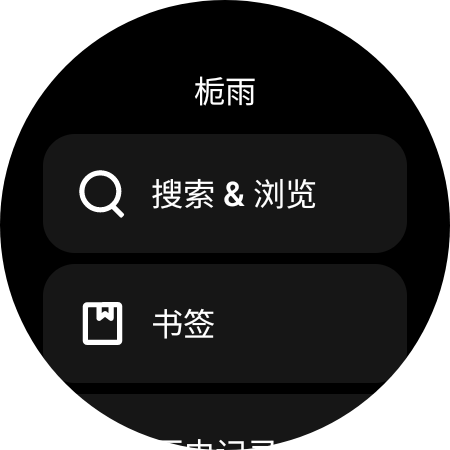
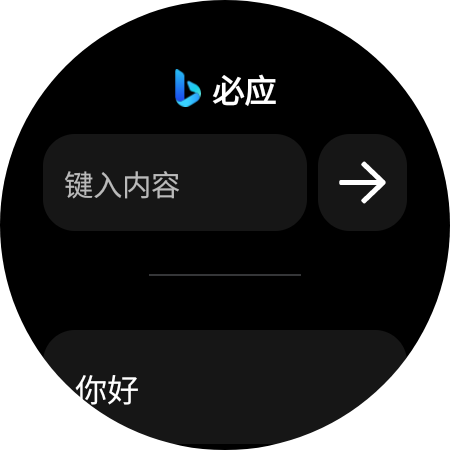
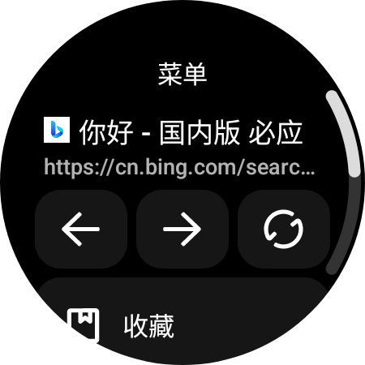
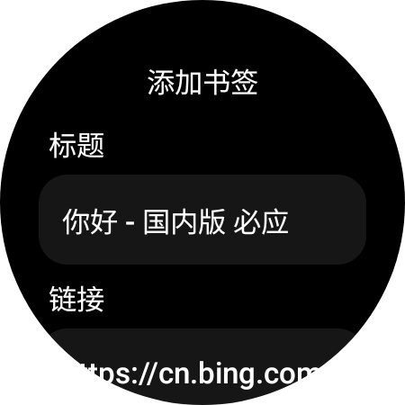
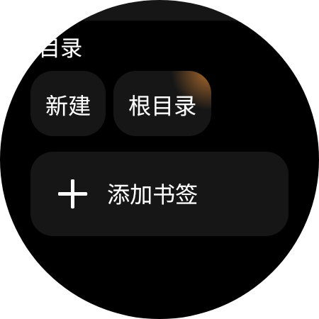
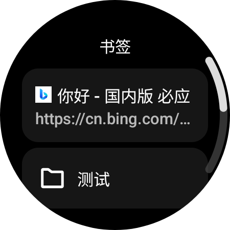
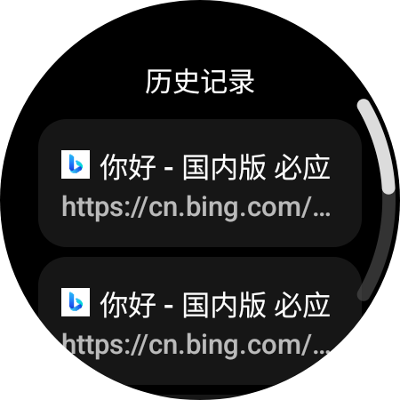

# 栀雨浏览器

体验最佳的手表浏览器

## 特色？

- 恰到好处的UI设计
- 多任务下载器
- HTML书签支持
- 内嵌Chromium79版本内核
- 搜索/历史记录
- 等等

## 应用截图

      

> [!NOTE]
> 测试硬件平台为 `Galaxy Watch 5 44MM`
>
> 系统版本为 `WearOS4 Android13`

## 发布日期

2026年之前某天

## 特别说明

> [!NOTE]
> 栀雨浏览器为非开源应用，此仓库只用于介绍应用
